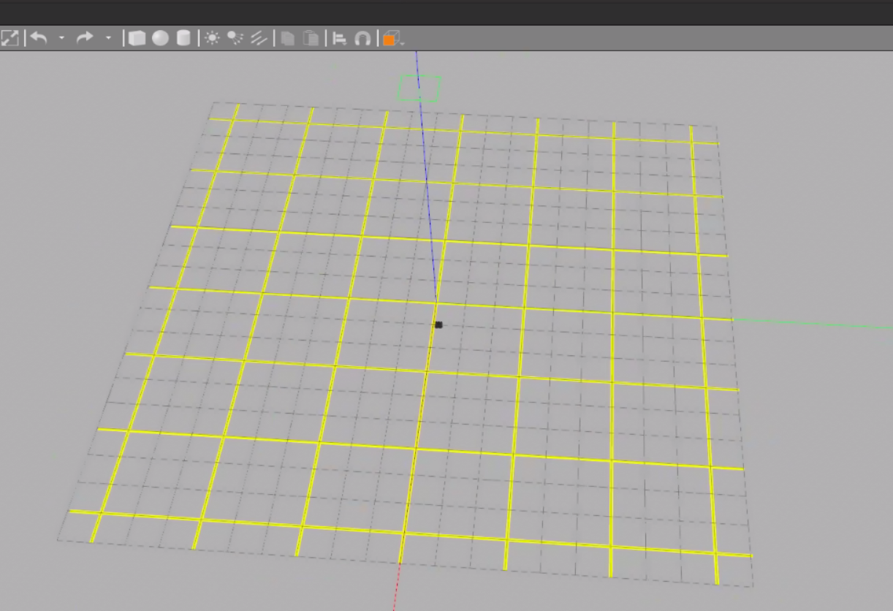

# Let's Just Dance

## Team Members: Leandra Nealer, Joyce Passananti, Daria Shifrina


<p align="center">
  
</p>

Final Project Repository for Introduction to Robotics. 


## Running Instructions 

### Update your source first:

```
$ cd ~/catkin_ws && catkin_make
$ source devel/setup.bash  
```


### Terminals:

```
$ roscore
```

```
$ roslaunch lets_just_dance turtlebot3_custom_world.launch
```

### References:

1. Multiple turtles: https://github.com/francimala/ROS_multiple_navigation
