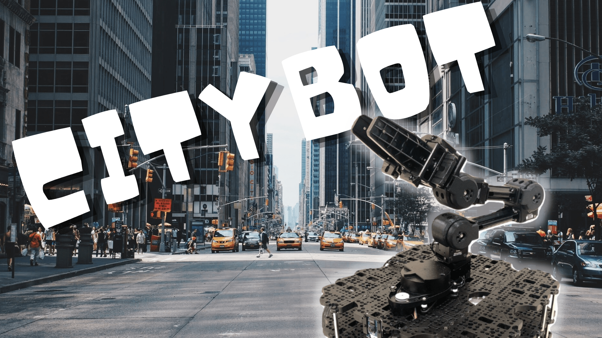
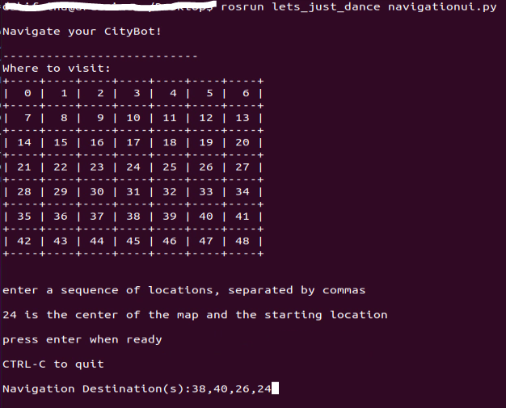

# Let's Just Dance

## Team Members: Leandra Nealer, Joyce Passananti, Daria Shifrina

## Demo Video

<p align="center">
  <a href="https://youtu.be/SYro1Mo5R_E" target="_blank"></a>
</p>


## Running Instructions 

### Update your source first:

```
$ cd ~/catkin_ws && catkin_make
$ source devel/setup.bash  
```


### Terminals:

```
$ roscore
```

```
$ roslaunch lets_just_dance turtlebot3_custom_world.launch
```
```
$ rosrun lets_just_dance robotmovement.py
```

```
$ rosrun lets_just_dance navigationui.py
```

## Writeup:

### Project Description: 

*Describe the goal of your project, why it's interesting, what you were able to make your robot do, and what the main components of your project are and how they fit together - please include diagrams and gifs when appropriate*

The motivation for our project was to create an advanced prototype of themes we have covered so far by combining more complex robot navigation and manipulation with a path finding algorithm. The main components of our project are: 

**Components:**
1) Given a list of locations in a city (imitated through a gazebo simulation), our bot will find the shortest route that it can take through all points. 
2) Move between nodes along the fastest path, Use odometry to detect when goal is reached, Stay centered on the path
3) While navigating, the bot will need to follow basic traffic rules: stop at stop signs, avoid driving on the sidewalk, avoid traffic cones. 
4) Navigation UI:
- <p>
  
</p>

Our robot can find the shortest route between any number of destinations on the map and navigate to the points without colliding into obstacles, stopping at stop signs, and avoiding bumping into one other moving robot. The other moving robot takes the same cyclical path around the street and our navigation bot stops and lets them pass when the situation comes up. 


### System Architecture: 

*Describe in detail the robotics algorithm you implemented and each major component of your project, highlight what pieces of code contribute to these main components*

**BFS Search Algorithm**: The graph takes as input the nodes in the grid, which are used to store locations. Unweighted/undirected edges are stored in a dictionary as Graph[a] = [b, c]. Searching the nearest edges first, the algorithm computes the shortest path to the destination and outputs a list of nodes the the goal.
* Graph initialization: Graph takes in the list of nodes you want to include in the graph. You can also adjust the size of the grid squares with self.n. For each node in the given list, the graph finds the adjacent nodes  (using the assumed grid layout) and forms edges with these adjacent nodes.
* bfs(): BFS is the implementation of the breadth first search algorithm for shortest path planning. BFS only works on nodes that are actually in the set of edges, but later functions will also allow navigation to locations along edges.
* plan_path(): Plan path combines plan_mult_paths and plan_path_single. These functions both use the BFS algorithm on an array of goals and a single goal respectively, and return the fastest path to the goal or goals. Plan path can take in either an array of goals or a single goal and runs the correct function.
* find_nearest_node_with_goal() and find_nearest_goal(): These functions are used to implement path planning to and between locations between nodes. find_nearest_goal finds the nearest node to the goal. find_nearest_node_with_goal finds the node to the src, but also considers which is closer to the goal to navigate to first.

**Navigation**: First, the user sends a set of points through the UI. The UI is written up in `navigationui.py`. The points are passed along through the `/navigate_vel` topic. Within `robotmovement.py`, we subscribe to the topic and process it within `run_sequence`. This function converts the list of integers from the UI into actual grid values using mod and division operations. Then it feeds the list of grid points into the BFS Graph algorithm described above. It takes the output and passes it into the `navigate_graph` function.
The `navigate_graph` function is a helper function that breaks up the lists of tuples and passes them into the `travel` function. 
The `travel` function navigates to a specific x,y value using the odometry topic. First, it rotates to the correct angle using the euler_from_quaternion function. Based on the proximity between theta and the angle difference to the goal, it sets angular z to a positive or a negative value to make rotation faster. Once the bot is facing the right direction, the bot then travels towards the target. Here, we add another feature using opencv2 to make sure the bot stays centered on the yellow grid lines while traveling forward to follow traffic rules.

**Perception**: Detect objects based on color: red for stop signs, orange for traffic cones, and black for other robots. When enough red pixels are detected to indicate an approximate distance from stop sign, then set robot's velocity to zero for 3 seconds. Following this, deactivate stopping until red pixels are significantly reduced, ensuring the robot doesn't stay stopped at a single sign. Detect orange for traffic cones, and when a certain distance away have the robot follow a specified movement pattern around the cone, then identify the yellow line again and continue on its way. Recognize proximity to the second robot and stop robot's movement to prevent collision (current code does not control second robot's movement, so the second robot can still run into the controlled one).

`detect_stopsign`, `avoid_robot_collision`, and `navigate_around_cone` were the main functions used for object detection and movement control.

### Challenges:

Challenges we faced when developing this project varied greatly and included creating a gazebo world and launch file, navigation between nodes, color and obstacle detection of more complex models, and adding multiple robots. As we hadn't created worlds and launch files from scratch before, figuring this out (as well as figuring out how to add/edit models) proved to be difficult however by referencing documentation/online guides and past projects we were able to accomplish it. Navigating to an edge between nodes was also difficult as we first had to find the nearest node in the graph to navigate to, then direct the robot to the goal location. Challenges with color and obstacle detection mostly centered around identifying what the robot was actually seeing, which proved difficult until we added the window view of the robot's camera. This was a relatively simple fix that then sped up progress as we realized the stop signs were too high and needed to be adjusted in the world, and also that the robot was detecting the black base of cones as another robot and therefore following the wrong movement path. Adding multiple robots was the last challenge, but proved very rewarding as it was one of our stretch goals. By referencing the multiple turtle guide (linked below) and playing around with it we were able to accomplish adding a second robot that drives in a cyclical path on the grid.


### Future Work:

Some elements we considered adding with more time were additional obsacles/traffic signs that have to be detected or evaded around while navigating such as pedestrians or traffic lights, and possibly even speed limits. We feel that would make our city simulation feel considerably more realistic while making the role of the robot more similar to a self driving car. We also want to implement a weighted graph for path planning that includes obstacles and different grid size, which would have edge weights that increase when the bot detects obstacles. Path planning would then consider the shortest path but also the easiest path with the least obstacles, and it would allow us to implement different and more complex types of maps besides grids.


### Takeaways:

- Having visual references when debugging can be a huge help and simplify the process much more than simply printing specific data.

### References:

1. Multiple turtles: https://github.com/francimala/ROS_multiple_navigation
